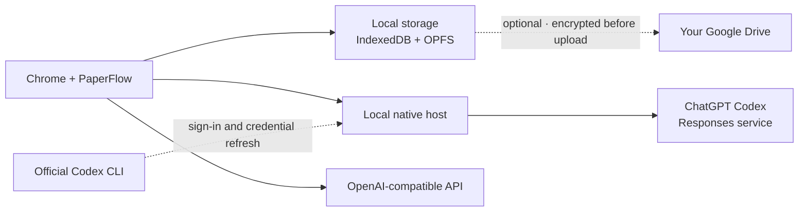

<div align="center">
  <a href="https://dai0-2.github.io/paperflow/">
    
  </a>
  <h1>PaperFlow</h1>
  <p><strong>Read where you find papers. Think where you read them.</strong></p>
  <p>A browser-native research workspace for Chrome.</p>
  <p>
    Read, annotate, ask, remember, and organize papers without leaving the browser.
  </p>
  <p>
    <a href="https://chromewebstore.google.com/detail/paperflow-ai/dffiahjmpkmellmjijffpcofoahbccoc"><strong>Add to Chrome</strong></a>
    &nbsp;&nbsp;·&nbsp;&nbsp;
    <a href="https://dai0-2.github.io/paperflow/"><strong>Visit website</strong></a>
    &nbsp;&nbsp;·&nbsp;&nbsp;
    <a href="#build-from-source"><strong>Build from source</strong></a>
  </p>
  <p>
    <strong>English</strong>
    &nbsp;·&nbsp;
    <a href="README.zh-CN.md">简体中文</a>
  </p>
  <p>
    <a href="https://github.com/Dai0-2/paperflow/actions/workflows/build.yml"></a>
    <a href="LICENSE"></a>
    
    
    
  </p>
</div>

<a href="https://dai0-2.github.io/paperflow/">
  
</a>

## Your PDF is the workspace

Research is often split across a PDF viewer, notes, a detached chatbot, browser
tabs, and a separate reference manager. PaperFlow brings those parts together
around the paper itself.

```text
Paper
├── metadata and identity
├── reading state
├── annotations and notes
├── source-linked conversations
└── Paper Memory
```

Open an arXiv paper where you found it, keep the original URL, and work inside
one persistent browser workspace. Return later and the paper still has its
position, notes, conversations, and saved context.

## AI that stays connected to the paper


Select text, ask a focused question, and receive a concise answer beside the
document. PaperFlow builds context from the selection, current page, and
relevant paper chunks. Structured citations link back to the cited page in the
Reader.

- Page-aware context instead of a detached chat upload
- Streaming answers with Markdown, tables, and research prompt shortcuts
- ChatGPT subscription access through the local Codex sign-in, isolated from user MCP configuration
- OpenAI-compatible API support with a custom base URL and model ID
- Direct API connections from the extension with device-local key storage

## Think directly on the paper


Highlight, underline, strike out, write a text note, capture an area, or draw
with ink. Annotations stay anchored in PDF coordinates, survive zoom changes,
and reopen with the paper.

Annotated work can be exported as a PDF copy, JSON, or Markdown. Local
full-text search and on-demand English and Simplified Chinese OCR are available
for papers that need them.

## Every paper remembers

PaperFlow treats each paper as a long-lived research object rather than a
temporary chat session.

| Persistent context | What is retained |
| --- | --- |
| Reading | Current page, position, and reader state |
| Evidence | Selections, annotations, comments, and notes |
| Conversation | Multiple threads, messages, and page citations |
| Memory | Saved insights and concise paper context |
| Identity | Metadata and source aliases for recognizing the same paper |

## Your papers become a research system


The library uses a dense research-table interface designed for scanning and
repeated work:

- Nested collections, tags, favorites, reading status, and reading history
- Field-aware search, duplicate review, trash, and bulk actions
- BibTeX and RIS import/export
- APA, MLA, Chicago, IEEE, and BibTeX citation copy
- Markdown notes, annotation summaries, attachments, and Paper Memory
- User-reviewed organization suggestions that never change the library silently

## Your research stays yours

PaperFlow is local-first. It does not operate a document backend.



- Paper metadata, reading state, notes, annotations, conversations, and memory
  remain local by default.
- Optional Google Drive sync uses the minimum `drive.file` scope and stores
  encrypted objects in the user's own `PaperFlow` folder.
- Offline PDF backup is separately controlled and disabled by default.
- PaperFlow does not scrape ChatGPT cookies. In subscription mode, the
  open-source Native Host reads the local OAuth credentials created by Codex
  CLI into memory and calls the ChatGPT Codex service directly. The access
  token never enters the Chrome extension, logs, or PaperFlow storage.
- Local OCR has no runtime CDN or remote-code dependency.

Read the [privacy notice](docs/privacy.md), [security policy](SECURITY.md), and
[architecture document](docs/architecture.md).

## Install

### Core workspace

[Install PaperFlow from the Chrome Web Store](https://chromewebstore.google.com/detail/paperflow-ai/dffiahjmpkmellmjijffpcofoahbccoc).

PaperFlow supports Chrome 114 or newer on macOS, Windows, and Linux. The
integrated Reader handles local and remote PDFs; arXiv PDF pages retain their
original `arxiv.org/pdf/...` address while PaperFlow runs in the page.

The Reader, annotations, research library, local storage, and Google Drive sync
work directly from the extension. They do not require the Native Host.

### Choose an AI connection

AI is optional. Choose exactly one setup:

| Connection | What to install |
| --- | --- |
| OpenAI-compatible API, including DeepSeek | PaperFlow from the Chrome Web Store only |
| ChatGPT subscription through Codex | PaperFlow, the official Codex CLI, and the PaperFlow Native Host |

You can switch either way at any time under **Settings > AI Provider**.
PaperFlow remembers the API model and Codex model settings separately.

#### Option A: OpenAI-compatible API

Install PaperFlow from the Chrome Web Store, open **Settings > AI Provider**,
choose **OpenAI-compatible API**, and enter the Base URL, API key, and model.

Do not download a Native Host, clone this repository, install Codex CLI, or
install Rust. The key remains in extension-local storage on this device and is
not synchronized.

#### Option B: ChatGPT subscription (Windows, macOS, and Linux)

All three operating systems support ChatGPT subscription mode. End users
install a prebuilt Native Host and do not need Git, Rust, Cargo, Visual Studio,
Xcode, or a source build.

1. Install PaperFlow from the Chrome Web Store.
2. Open PowerShell on Windows or a terminal on macOS/Linux and check:

   ```bash
   codex --version
   ```

   If this works, for example because the official Codex app or CLI is already
   installed, skip to step 4. You do not need a separate Node.js installation.

3. If `codex` is unavailable, install Node.js 20 or newer, then install the
   official Codex CLI. On Windows:

   ```powershell
   winget install --id OpenJS.NodeJS.LTS -e
   npm.cmd install -g @openai/codex
   ```

   On macOS/Linux:

   ```bash
   npm install -g @openai/codex
   ```

4. Complete the official sign-in and verify it:

   ```bash
   codex login
   codex login status
   ```

   The second command should report that ChatGPT is signed in. Do not run
   `codex exec`, and do not disable Notion, Zotero, or other MCP servers.

5. Download the Native Host for the current operating system:

   - [Windows](https://github.com/Dai0-2/paperflow/releases/latest/download/paperflow-native-host-windows.zip)
   - [macOS](https://github.com/Dai0-2/paperflow/releases/latest/download/paperflow-native-host-macos.zip)
   - [Linux](https://github.com/Dai0-2/paperflow/releases/latest/download/paperflow-native-host-linux.zip)

6. Extract the archive and install:

   - Windows: double-click `INSTALL-PAPERFLOW.cmd`.
   - macOS: run `bash install-macos.sh` in the extracted folder.
   - Linux: run `sh install-linux.sh` in the extracted folder.

7. Fully close and reopen Chrome. In PaperFlow choose
   **ChatGPT subscription > Sign in with ChatGPT**.

The prebuilt packages are currently unsigned, so the operating system may show
a security warning. The Host invokes the official Codex CLI only for sign-in
and credential refresh. Paper chat goes directly from the Host to the Codex
Responses service, so user MCP servers, plugins, and tools are not loaded. The
Host reads the OAuth token from the Codex CLI credential file but never exposes,
logs, or separately persists it. See
[Native Host setup](docs/native-host.md) for source builds, uninstall
instructions, and troubleshooting.

### Build the extension from source

This path is for contributors and users testing an unreleased build. It is not
required after installing from the Chrome Web Store.

Requirements for the extension: Node.js 20+ and pnpm 10+.

```bash
git clone https://github.com/Dai0-2/paperflow.git
cd paperflow
pnpm install
pnpm build
```

Open `chrome://extensions`, enable **Developer mode**, choose **Load unpacked**,
and select `dist/`. Rust and the Native Host build/install steps are needed only
when testing ChatGPT subscription mode.

## Development

```bash
pnpm install
pnpm dev
pnpm typecheck
pnpm test
pnpm build
pnpm audit:release
pnpm test:e2e
```

The extension is built with React, TypeScript, PDF.js, Dexie, Zustand, and
Chrome Manifest V3. The native bridge is written in Rust.

## Current limits

- Remote PDFs behind login walls or restrictive CORS must be opened locally.
- OCR is intentionally on demand and processes up to 50 pages per run.
- Search locates matching pages but does not yet provide full in-page result
  stepping.
- Citation clicks navigate to the cited page; precise citation-range
  highlighting is not yet available.
- PaperFlow currently has no collaboration, vector database, or account/payment
  system.

## Contributing

Issues and pull requests are welcome. Start with
[CONTRIBUTING.md](CONTRIBUTING.md), then review the
[release checklist](docs/release-checklist.md) before shipping a build.

## License

PaperFlow is open source under the [Apache License 2.0](LICENSE). Bundled
dependencies retain their own licenses; see
[THIRD_PARTY_NOTICES.md](THIRD_PARTY_NOTICES.md).
