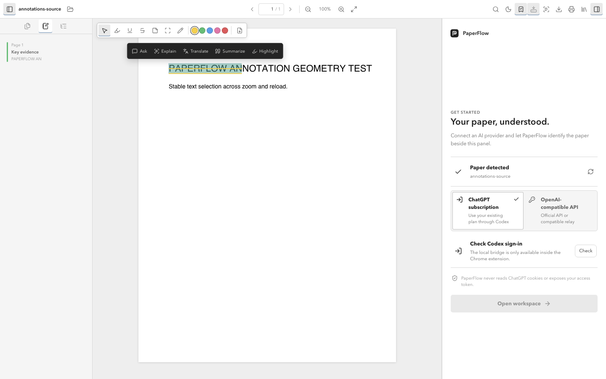
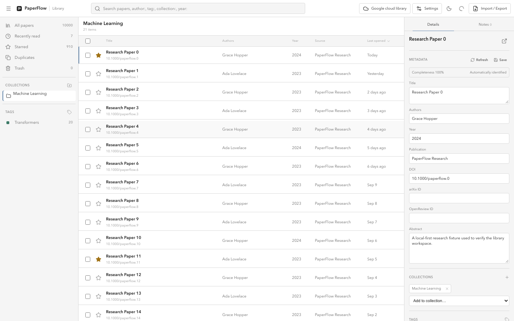
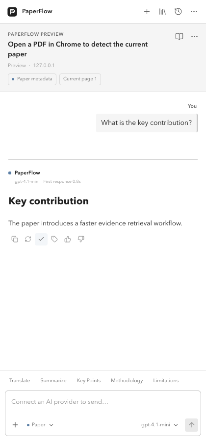

<div align="center">
  
  <h1>PaperFlow AI</h1>
  <p><strong>A persistent AI research companion beside every paper.</strong></p>
  <p>Read, annotate, ask, remember, and sync without giving up your data.</p>
  <p>
    <a href="https://dai0-2.github.io/paperflow-ai/"><strong>Website</strong></a>
    ·
    <a href="https://chromewebstore.google.com/detail/paperflow-ai/dffiahjmpkmellmjijffpcofoahbccoc"><strong>Chrome Web Store</strong></a>
    ·
    <a href="#install"><strong>Build from source</strong></a>
  </p>
  <p><strong>English</strong> · <a href="README.zh-CN.md">简体中文</a></p>
  <p>
    <a href="https://github.com/Dai0-2/paperflow-ai/actions/workflows/build.yml"></a>
    <a href="LICENSE"></a>
    
    
  </p>
</div>

<a href="https://dai0-2.github.io/paperflow-ai/">
  
</a>

> [!IMPORTANT]
> PaperFlow AI 1.0.2 is a local-first personal research library, PDF reader,
> annotation workspace, and AI companion. Sign in with Google to sync encrypted
> research data through your own Drive. PaperFlow does not operate a document
> backend.

## Product at a glance

| Research library | AI beside the paper |
| --- | --- |
|  |  |
| Collections, metadata, full-text search, citations, and reading history. | Page-aware questions, streaming answers, notes, and per-paper memory. |

## Why PaperFlow

PaperFlow is not a generic ChatPDF clone. It can live in Chrome's Side Panel beside an existing viewer, or open a PDF in its own integrated Reader so page position, text selection, citations, and AI context can work together.

Every paper is designed to have its own long-lived workspace:

```text
Paper
├── metadata and identity
├── conversations
├── selections and notes
├── paper memory
└── reading state
```

Open the same paper days later—from a different source when identity can be resolved—and continue the same line of thought.

## Personal library

- Nested collections, tags, favorites, reading status, trash, bulk actions, and
  duplicate review
- Virtualized dense table for large libraries and field-aware search filters
- Markdown notes, annotation summaries, PDF attachments, and per-paper AI memory
- BibTeX/RIS import and export; APA, MLA, Chicago, IEEE, and BibTeX copy
- User-confirmed AI organization suggestions that never modify the library
  before review
- Local-first IndexedDB and OPFS storage with optional encrypted Google Drive
  sync; offline PDF backup remains separately controlled and off by default

## Integrated Reader

- Extension page at `reader.html?url=<encoded-pdf-url>` for remote PDFs, plus a local PDF picker
- Continuous, lazy PDF.js rendering with text layers, thumbnails, document outline, search navigation, zoom, fit width, download, and print
- Current-page tracking, keyboard navigation, responsive narrow-window fit, and light/dark reading surfaces without recoloring PDF pages
- Reusable PaperFlow AI workspace embedded in a resizable right panel
- Text-selection actions for asking, explaining, translating, summarizing, and saving
- PDF-coordinate annotation layer with highlight, underline, strikeout, text note, area note, and ink tools
- Annotation comments, colors, deletion, zoom-safe persistence, and offline reopening
- Annotated PDF copy export through `pdf-lib`, with standard text-note comments and JSON/Markdown fallback
- Explicit offline PDF storage in OPFS, local full-text search, and on-demand English/Simplified Chinese OCR
- Page-aware chunked context; selected text is preferred over the current page and relevant paper chunks
- Structured citations with page, label, and excerpt; citation clicks navigate the Reader
- Explicit errors for missing, blocked, encrypted, or textless PDFs
- arXiv PDF pages keep their original `arxiv.org/pdf/...` URL and favicon while PaperFlow Reader is mounted in-page; other direct PDFs use the extension Reader
- Immediate hover labels identify compact Reader and annotation toolbar controls

## Side Panel and AI

- Minimal Chrome Manifest V3 Side Panel
- Active-tab detection for arXiv, OpenReview, direct PDFs, and compatible PDF viewers
- On-demand text extraction for accessible arXiv PDFs when AI context is needed
- PDF, TXT, Markdown, and image attachments from a ChatGPT-style composer menu
- Two provider modes: ChatGPT subscription through the official Codex CLI, or an OpenAI API key through the Responses API
- API keys stored in the operating-system credential store rather than Chrome extension storage
- Custom API base URL, model ID, and Responses/Chat Completions compatibility mode
- Independent English/Chinese switches for the interface and model prompts
- User-message bubbles with copy and edit-to-resend; answer copy, regenerate, save-to-memory, tags, and local feedback
- Live answer progress for ChatGPT subscription mode and token streaming for API mode
- Low-latency reasoning configuration and bounded conversation history to prevent progressive slowdowns
- Per-paper IndexedDB storage for papers, aliases, threads, messages, memory, selections, annotations, settings, and reading state
- One-click Google account sign-in and encrypted Drive sync using only the
  minimum `drive.file` scope
- Automatic sync for the library, notes, annotations, conversations, and
  reading progress; offline PDF backup remains an explicit opt-in
- One-time migration of legacy `localStorage` conversations and notes
- First-run setup and connection diagnostics
- Research conversation with Markdown and tables
- Page-citation interaction prototype
- Selected-text context preview
- Prompt shortcuts: Translate, Summarize, Key Points, Methodology, and Limitations
- Conversation history and multiple-thread UI
- Paper Memory view
- Provider connection status and model selector UI
- Light, dark, and system themes
- Responsive layout for 360–440 px panels
- Keyboard navigation, focus states, and reduced-motion support

## Known limits

- Subscription requests still invoke `codex exec`; a persistent official Codex app server should be evaluated later.
- Generation cancellation is not yet reliable.
- Search navigates matching pages but does not yet provide a full match list or in-page match stepping.
- Citation-range highlighting is not yet rendered.
- OCR is intentionally on demand and limited to 50 pages per run.
- Remote PDFs behind login walls or restrictive CORS must be downloaded and opened locally.
- Real Google Drive two-device release validation still requires a production OAuth client ID; automated tests use an in-memory two-device Drive adapter.
- No collaboration, vector database, or account/payment system.

## Install

### Requirements

- Chrome 114 or newer on macOS, Windows, or Linux
- ChatGPT desktop app or Codex CLI for subscription mode; an OpenAI Platform API key for API mode
- Node.js 20 or newer
- pnpm 10 or newer
- Rust stable when building the Native Host from source

### Load the extension

```bash
git clone https://github.com/Dai0-2/paperflow-ai.git
cd paperflow-ai
pnpm install
pnpm build
cargo build --release --locked --manifest-path native-host/Cargo.toml
# macOS
bash native-host/install/install-macos.sh
# Linux
sh native-host/install/install-linux.sh
# Windows PowerShell
.\native-host\install\install-windows.ps1
```

Google Drive development builds require a Chrome Extension OAuth client ID:

```bash
cp .env.example .env.local
# Set PAPERFLOW_GOOGLE_OAUTH_CLIENT_ID in .env.local
pnpm build
```

Without a client ID, local development builds remain loadable and show Drive
sync as unconfigured. `vite build --mode release` fails closed when it is absent.

Then:

1. Open `chrome://extensions`.
2. Enable **Developer mode**.
3. Select **Load unpacked**.
4. Choose the generated `dist/` folder.
5. Pin PaperFlow AI and click its toolbar icon for the Side Panel.
6. Right-click a PDF link or page and choose **Open with PaperFlow** for the integrated Reader.

The installer registers the Rust Native Messaging host for PaperFlow's fixed extension ID. It invokes the official Codex CLI with fixed arguments for subscription mode and stores an optional API key in macOS Keychain, Windows Credential Manager, or Linux Secret Service. It never reads ChatGPT cookies or Codex authentication files. Run `codex login` in a terminal before using subscription mode.

After rebuilding or reinstalling, click **Reload** for PaperFlow AI on `chrome://extensions`. If Chrome cannot find the host, rerun the platform installer and reload the extension. See [Native Host setup](docs/native-host.md) for paths, uninstall commands, and the one-release Python fallback.

### Development preview

```bash
pnpm dev
```

Open the printed localhost URL for the Side Panel, or `/reader.html` for the Reader open screen. Resize to 360–440 px to verify narrow layouts.

## Provider architecture

PaperFlow will not read ChatGPT cookies, expose OAuth tokens to the extension, or call private ChatGPT web endpoints.

```text
Chrome Extension
       │ Chrome Native Messaging
       ▼
PaperFlow Bridge
       │
       ├── ChatGPT subscription → official Codex status/exec
       └── API key → OS credential store → OpenAI-compatible API
```

The local bridge invokes the official Codex CLI for subscription access. API keys remain in the operating-system credential store and are never returned to the extension. See [the architecture document](docs/architecture.md).

Google Drive access is separate from AI providers. Chrome Identity manages the
OAuth token with the `drive.file` scope. PaperFlow encrypts each cloud object
before upload and stores account-managed key material in the user's PaperFlow
Drive folder. Signing in with the same Google account restores the workspace
without a separate vault password or recovery-key flow.

## Privacy and security

- No analytics or telemetry in the prototype
- No API keys or OAuth tokens in the repository
- No ChatGPT cookie scraping
- No PDF uploads unless **Back up offline PDFs** is explicitly enabled
- Paper context will be visible and user-controllable before transmission
- Paper data is designed to remain local by default
- Google Drive sync is opt-in, uses only `drive.file`, and uploads encrypted
  opaque objects
- Local OCR has no runtime CDN or remote code dependency
- Database upgrade failure enters a read-only recovery export flow

Read the [privacy notice](docs/privacy.md), [security policy](SECURITY.md),
[migration/rollback guide](docs/migration-and-rollback.md), and
[release checklist](docs/release-checklist.md).

## Development

```bash
pnpm install
pnpm dev
pnpm typecheck
pnpm test
pnpm build
pnpm audit:release
pnpm test:e2e
pnpm package
```

Project structure:

```text
src/
├── components/
│   ├── chat/
│   ├── common/
│   ├── composer/
│   ├── layout/
│   ├── paper/
│   ├── reader/
│   └── views/
├── data/
├── hooks/
├── services/
├── store/
├── styles/
└── types/
```

Contributions are welcome. See [CONTRIBUTING.md](CONTRIBUTING.md).

## Roadmap

- [x] Phase 1 — production-quality UI prototype
- [x] Phase 2 alpha — active-paper detection, local persistence, and PDF attachments
- [x] Phase 3 alpha — Codex CLI bridge and ChatGPT sign-in
- [x] Phase 3.1 — OpenAI API-key provider adapter
- [x] Phase 3.2 — streaming progress, bilingual prompts, and provider compatibility controls
- [x] Phase 4 MVP — selection, current page, and structured paper context
- [x] Phase 5 MVP — IndexedDB memory, citations, and page navigation
- [x] Phase 6 alpha — Native Messaging bridge and Codex CLI sign-in
- [x] Phase 7 MVP — integrated PDF.js Reader

## Acknowledgements

PaperFlow's provider and local-bridge research was informed by the open-source [AIdea for Zotero](https://github.com/Visterainer/aidea-zotero) project. PaperFlow is an independent implementation for Chrome and does not copy AIdea's source code.

The integrated Reader uses Mozilla PDF.js (`pdfjs-dist`) under the Apache License 2.0. The license is shipped as `pdfjs-LICENSE.txt` in the extension package. Google Scholar PDF Reader is an interaction reference only; no Google extension code or assets are included.

## License

PaperFlow AI source code is licensed under Apache License 2.0. See [LICENSE](LICENSE).
Bundled dependencies retain their own licenses; see
[THIRD_PARTY_NOTICES.md](THIRD_PARTY_NOTICES.md).
