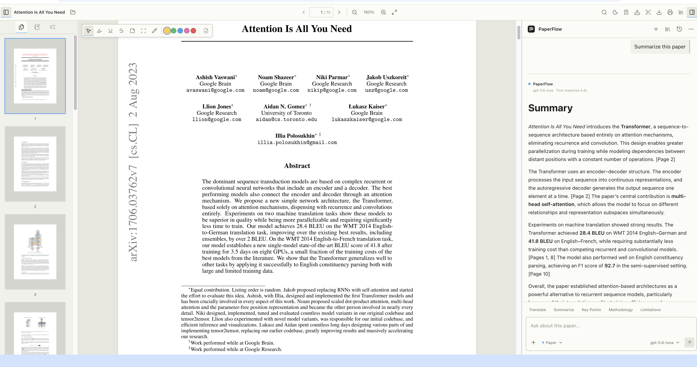
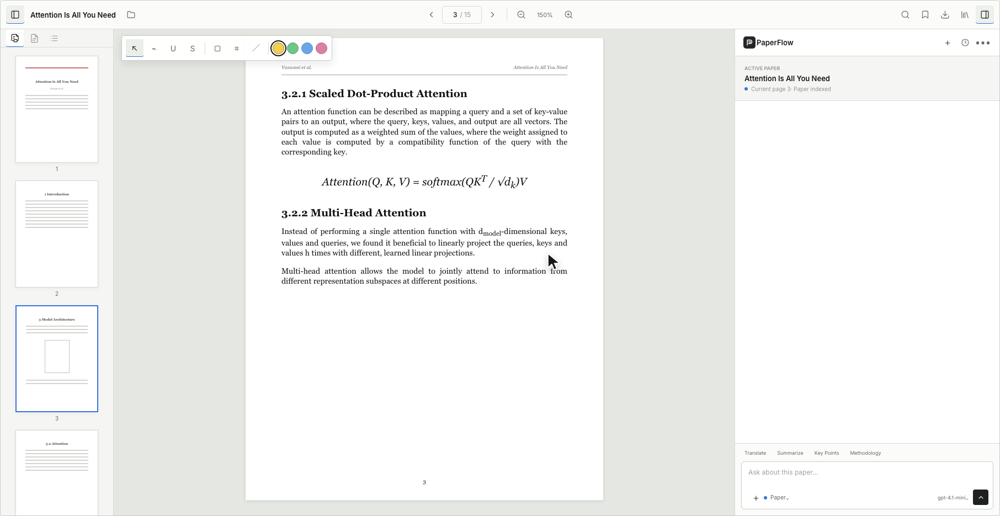
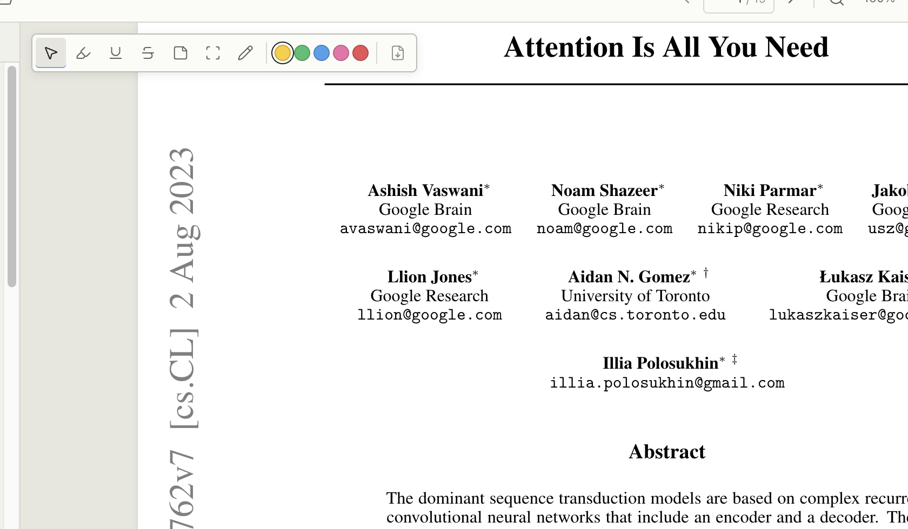
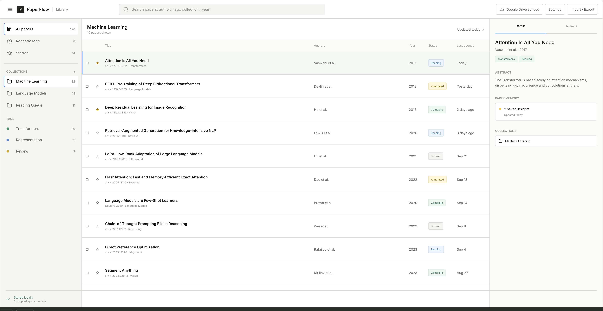
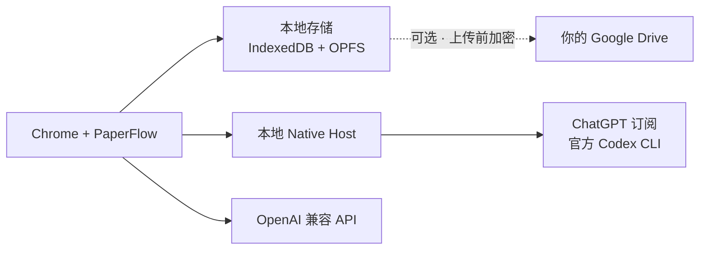

<div align="center">
  <a href="https://dai0-2.github.io/paperflow/">
    
  </a>
  <h1>PaperFlow</h1>
  <p><strong>在发现论文的地方阅读，在阅读论文的地方思考。</strong></p>
  <p>为 Chrome 打造的浏览器原生研究工作区。</p>
  <p>无需离开浏览器，即可阅读、批注、提问、记忆和整理论文。</p>
  <p>
    <a href="https://chromewebstore.google.com/detail/paperflow-ai/dffiahjmpkmellmjijffpcofoahbccoc"><strong>添加到 Chrome</strong></a>
    &nbsp;&nbsp;·&nbsp;&nbsp;
    <a href="https://dai0-2.github.io/paperflow/"><strong>访问官网</strong></a>
    &nbsp;&nbsp;·&nbsp;&nbsp;
    <a href="#从源码构建"><strong>从源码构建</strong></a>
  </p>
  <p>
    <a href="README.md">English</a>
    &nbsp;·&nbsp;
    <strong>简体中文</strong>
  </p>
  <p>
    <a href="https://github.com/Dai0-2/paperflow/actions/workflows/build.yml"></a>
    <a href="LICENSE"></a>
    
    
    
  </p>
</div>

<a href="https://dai0-2.github.io/paperflow/">
  
</a>

## 让 PDF 成为工作区

研究过程常常被拆散在 PDF 阅读器、笔记、独立聊天窗口、浏览器标签页和文献管理器中。
PaperFlow 将这些环节重新组织在论文原文周围。

```text
Paper
├── 元数据与论文身份
├── 阅读状态
├── 批注与笔记
├── 与原文关联的对话
└── Paper Memory
```

在发现 arXiv 论文的地方直接打开，保留原始网址，并在同一个浏览器工作区中完成研究。
几天后再次打开，阅读位置、笔记、对话与保存的上下文仍然属于这篇论文。

## 始终连接原文的 AI



划选文字、提出具体问题，并在文档旁获得简洁回答。PaperFlow 会结合选中文字、当前页与
论文相关片段构建上下文，结构化 Citation 可直接跳转到 Reader 中的引用页。

- 页码感知上下文，而不是脱离原文的聊天上传
- 支持 Markdown、表格与科研快捷提示的流式回答
- 通过官方 Codex CLI 使用 ChatGPT 订阅
- 支持自定义 Base URL 与模型 ID 的 OpenAI 兼容 API
- 扩展直连 API，API Key 仅保存在当前设备的浏览器配置中

## 直接在论文上思考



支持高亮、下划线、删除线、文本笔记、区域批注和手写。所有批注使用 PDF 坐标锚定，
缩放后仍能保持位置，并会随论文一起重新打开。

批注结果可导出为 PDF 副本、JSON 或 Markdown。对于需要处理的论文，还提供本地全文
搜索和按需中英文 OCR。

## 每篇论文都会记住

PaperFlow 将论文视为长期存在的研究对象，而不是一次性的聊天会话。

| 持久化上下文 | 保留内容 |
| --- | --- |
| 阅读 | 当前页、阅读位置和 Reader 状态 |
| 证据 | 划选、批注、评论与笔记 |
| 对话 | 多个 Thread、消息与页码引用 |
| 记忆 | 保存的洞见与精简论文上下文 |
| 身份 | 元数据与来源别名，用于识别同一篇论文 |

## 让论文形成研究系统



资料库采用适合扫描、比较和重复操作的高密度研究表格：

- 集合与子集合、标签、星标、阅读状态和阅读历史
- 字段搜索、重复项检查、回收站和批量操作
- BibTeX 与 RIS 导入导出
- APA、MLA、Chicago、IEEE 与 BibTeX 引用复制
- Markdown 笔记、批注摘要、附件与 Paper Memory
- 所有整理建议都必须经过用户确认，不会静默修改资料库

## 你的研究仍然属于你

PaperFlow 坚持本地优先，不运营文档后端。



- 论文元数据、阅读状态、笔记、批注、对话和记忆默认保存在本地。
- 可选 Google Drive 同步仅申请最小 `drive.file` 权限，加密对象存放在用户自己的
  `PaperFlow` 文件夹中。
- 离线 PDF 备份独立控制，默认关闭。
- PaperFlow 不读取 ChatGPT Cookie，也不调用 ChatGPT 私有网页接口。
- 本地 OCR 不依赖运行时 CDN 或远程代码。

请阅读[隐私说明](docs/privacy.md)、[安全策略](SECURITY.md)和
[架构文档](docs/architecture.md)。

## 安装

### 使用核心工作区

[从 Chrome Web Store 安装 PaperFlow](https://chromewebstore.google.com/detail/paperflow-ai/dffiahjmpkmellmjijffpcofoahbccoc)。

PaperFlow 支持 macOS、Windows 和 Linux 上的 Chrome 114 或更高版本。
集成 Reader 可以打开本地与远程 PDF；arXiv PDF 会保留原始
`arxiv.org/pdf/...` 地址，PaperFlow 直接运行在页面中。

Reader、批注、研究资料库、本地存储和 Google Drive 同步安装扩展后即可使用，
不需要安装 Native Host。

### 连接 ChatGPT 订阅

AI Provider 是可选功能。使用 ChatGPT 订阅需要：

1. 安装官方 Codex CLI。
2. 安装 PaperFlow Native Host。
3. 在 PaperFlow 中完成一次浏览器登录。

安装官方 Codex CLI：

```bash
# macOS / Linux
npm install -g @openai/codex

# Windows PowerShell
npm.cmd install -g @openai/codex
```

Chrome Web Store 扩展无法自行安装或启动本机程序，因此 Native Host 必须单独安装。
它只调用官方 Codex CLI，不会向扩展暴露 Codex 的认证数据。

> [!NOTE]
> 已签名的一键 Native Host 安装包尚未公开发布。在正式发布前，只需从源码构建并
> 安装 Native Host：

```bash
git clone https://github.com/Dai0-2/paperflow.git
cd paperflow
cargo build --release --locked --manifest-path native-host/Cargo.toml
```

```bash
# macOS
bash native-host/install/install-macos.sh

# Linux
sh native-host/install/install-linux.sh

# Windows PowerShell
.\native-host\install\install-windows.ps1
```

打开 PaperFlow，选择“ChatGPT 订阅”，再点击“登录 ChatGPT”。PaperFlow 会启动
官方 Codex 浏览器授权流程，通常无需再手动执行 `codex login`。

OpenAI 兼容 API 模式不需要 Native Host。PaperFlow 只申请访问用户填写的 API
域名，将 API Key 保存在当前设备的扩展本地存储中，并由扩展直接向所选服务商发送请求；
密钥不会同步。浏览器配置存储的隔离性弱于操作系统凭据库，建议使用可撤销、权限受限的
API Key。Google Drive 同步同样不使用 Native Host。

安装与故障排查详见 [Native Host 文档](docs/native-host.md)。

### 从源码构建扩展

此路径供贡献者或测试未发布版本的用户使用。从 Chrome Web Store 安装后无需执行。

扩展构建环境要求：Node.js 20+ 和 pnpm 10+。

```bash
git clone https://github.com/Dai0-2/paperflow.git
cd paperflow
pnpm install
pnpm build
```

打开 `chrome://extensions`，启用“开发者模式”，选择“加载已解压的扩展程序”，
并选中 `dist/`。只有测试 ChatGPT 订阅模式时才需要 Rust，并执行 Native Host
构建与安装步骤。

## 开发

```bash
pnpm install
pnpm dev
pnpm typecheck
pnpm test
pnpm build
pnpm audit:release
pnpm test:e2e
```

扩展使用 React、TypeScript、PDF.js、Dexie、Zustand 与 Chrome Manifest V3；
本地 Bridge 使用 Rust。

## 当前限制

- 登录墙或严格 CORS 限制的远程 PDF 需要下载后从本地打开。
- OCR 采用按需处理方式，单次最多处理 50 页。
- 搜索可以定位匹配页面，但尚未提供完整页内结果逐项跳转。
- Citation 可跳转到引用页，但尚未实现精确的引用范围高亮。
- 当前不包含团队协作、向量数据库和账号付费系统。

## 参与贡献

欢迎提交 Issue 和 Pull Request。请先阅读
[CONTRIBUTING.md](CONTRIBUTING.md)，发布构建前请检查
[发布清单](docs/release-checklist.md)。

## 许可证

PaperFlow 基于 [Apache License 2.0](LICENSE) 开源。捆绑依赖保留各自许可证，
详见 [THIRD_PARTY_NOTICES.md](THIRD_PARTY_NOTICES.md)。
